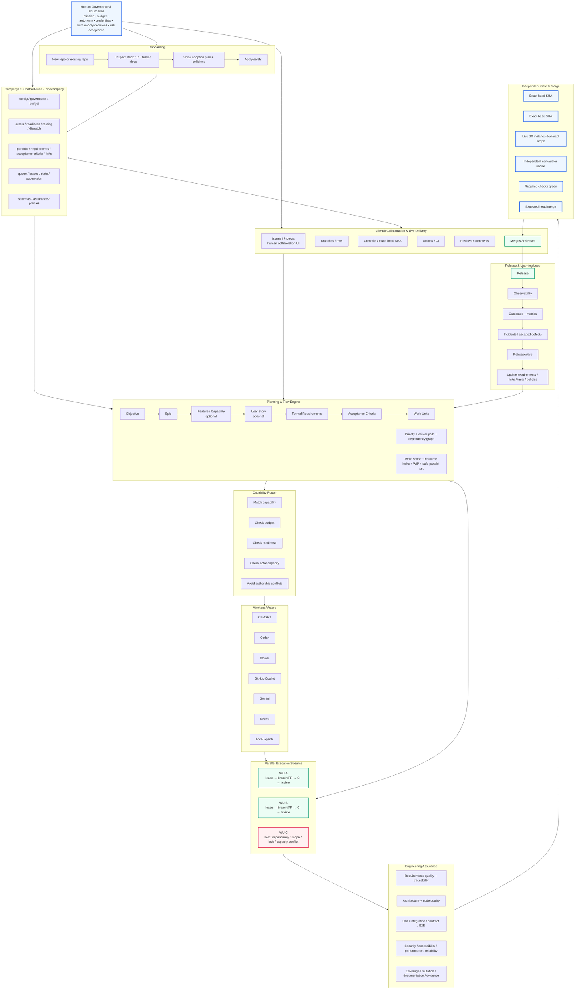

# How CompanyOS Works

OneCompany is a governed autonomous-company runtime. The diagram below is the canonical high-level operating view of the system.

## Core invariants

- GitHub live state is authoritative for branches, PRs, exact SHAs, CI, reviews and merges.
- Versioned `.onecompany` files are authoritative for approved planning intent and policy.
- Exactly one canonical writer/implementation stream exists **per Work Unit**.
- Multiple WUs may execute concurrently only when dependencies, write scopes, semantic locks, risk, WIP and actor capacity prove them independent.
- A merge-ready gate is bound to the exact candidate head **and** exact base SHA; base movement stales integration evidence.
- Live PR changes must remain inside the WU's declared write scope.
- Failover changes the worker, not the canonical WU stream or its authorship history.
- Material authors may not be the sole independent final reviewer.
- Budget exhaustion or provider quota does not create authority to spend.
- Human sovereignty remains explicit for credentials, budget policy, legal/governance decisions, destructive production actions and critical risk acceptance.
- Release outcomes feed back into requirements, risks, tests, policies and future planning.

See also [`ARCHITECTURE.md`](ARCHITECTURE.md), [`ONBOARDING.md`](ONBOARDING.md), and the engineering standards under [`engineering/`](engineering/).
